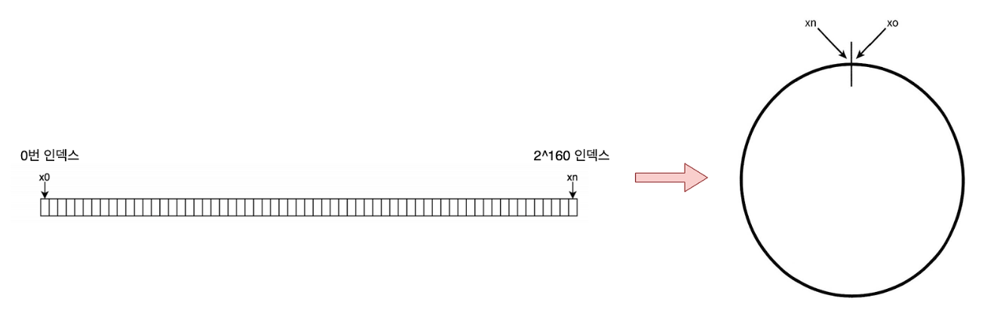
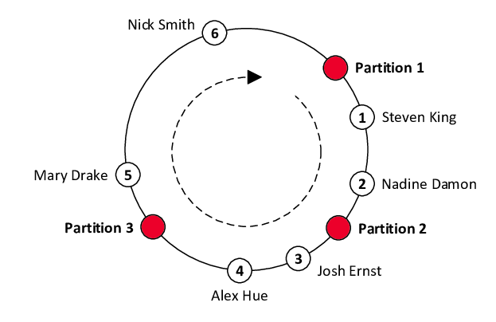
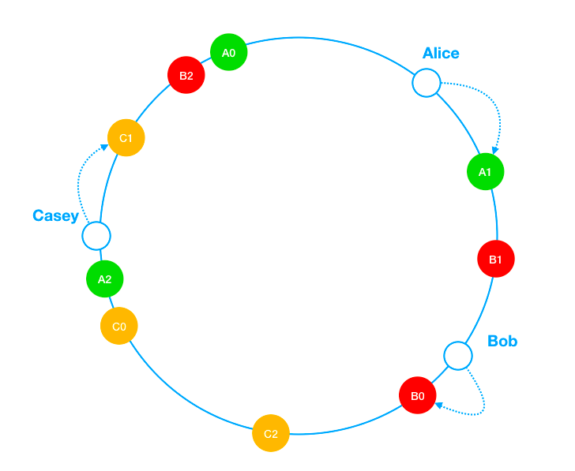

# 05 안정 해시 설계

수평적 규모 확장성을 달성하려면 **요청이나 데이터를 서버에 균등하게 나누는 것**이 중요하다. 안정 해시는 이 목표를 달성하기 위해 보편적으로 사용되는 기술로, 서버가 추가되거나 제거될 때 **재배치되는 키의 양을 최소화**하는 것이 핵심이다.

## 키 재배치

N개의 캐시 서버에 부하를 균등하게 나누는 가장 단순한 방법은 다음과 같다.

serverIndex = hash(key) % N

서버가 4대(`N = 4`)일 때, 키는 아래처럼 분배된다.

| 키 | Hash | Hash % 4 |
|---|---|---|
| key0 | 18,358,617 | 1 |
| key1 | 26,143,584 | 0 |
| key2 | 18,131,146 | 2 |
| key3 | 35,863,496 | 0 |
| key4 | 34,085,809 | 1 |
| key5 | 27,581,703 | 3 |
| key6 | 38,164,978 | 2 |
| key7 | 22,530,351 | 3 |

| 서버 | 보관 키 |
|---|---|
| server0 | key1, key3 |
| server1 | key0, key4 |
| server2 | key2, key6 |
| server3 | key5, key7 |

여기서 **server1이 장애로 빠지면** 서버 풀 크기가 `N = 3`으로 바뀌고, 같은 해시값이라도 나머지 연산 결과가 달라진다.

| 키 | Hash | Hash % 3 |
|---|---|---|
| key0 | 18,358,617 | 0 |
| key1 | 26,143,584 | 0 |
| key2 | 18,131,146 | 1 |
| key3 | 35,863,496 | 2 |
| key4 | 34,085,809 | 1 |
| key5 | 27,581,703 | 0 |
| key6 | 38,164,978 | 1 |
| key7 | 22,530,351 | 0 |

| 서버 | 보관 키 |
|---|---|
| server0 | key0, key1, key5, key7 |
| server2 | key2, key4, key6 |
| server3 | key3 |

장애가 발생한 server1뿐 아니라 **거의 모든 키가 다른 서버로 재배치**된다. 그 결과 캐시 클라이언트는 대부분 데이터가 없는 서버에 접속하게 되고, **대규모 캐시 미스가 동시다발적으로 발생**한다.

## 안정 해시의 동작 방식

안정 해시는 해시 테이블의 크기가 조절될 때 **평균적으로 $k/n$개의 키만 재배치되는** 해시 기술이다. ($k$ = 키의 개수, $n$ = 슬롯 개수)

해시 함수의 출력 공간 $x_0, x_1, \ldots, x_{n-1}$ 을 **원형(ring)으로 구부려** 사용한다.



> 참고: 강대명님의 [Consistent Hashing 설명 영상](https://youtu.be/mPB2CZiAkKM?t=3580)

### 키 → 서버 매핑 규칙

균등 분포 해시 함수를 사용해 서버와 키를 같은 링 위에 올려놓고, 키에서 **시계 방향으로 가장 먼저 만나는 서버**에 키를 할당한다.



위 이미지를 예로 들면,

- `Nick Smith` → `Partition 1`
- `Steven King` → `Partition 2`

### 서버 추가

- `Mary Drake`와 `Nick Smith` 사이에 `Partition 4` 생성
- `Mary Drake`만 `Partition 4`로 이동

### 서버 제거

- `Partition 3` 제거
- `Alex Hue`, `Josh Ernst`만 시계 방향 다음 노드인 `Partition 1`로 이동

이렇게 하면 서버가 변동될 때 **재배치되는 키의 범위가 인접 구간으로 한정**되므로, 단순 해시 방식의 대규모 캐시 미스를 피할 수 있다.

### 파티션 크기의 불균등

균등 분포 해시 함수를 써도, 링 위에 놓인 **서버 사이의 간격(Hash Partition)을 균등하게 유지하는 것은 불가능**하다. 그 결과 어떤 서버는 큰 구간을, 어떤 서버는 작은 구간을 담당하게 되어 **데이터/트래픽 분포가 한쪽으로 쏠릴** 수 있다.

## 가상 노드 (Virtual Node)



가상 노드는 **실제 노드(서버)를 가리키는 논리적 노드**다. 하나의 서버를 링 위에 **여러 개의 가상 노드로 표현**해서 분포를 평탄하게 만든다.

- 가상 노드 개수를 늘릴수록 **분포의 표준 편차가 작아져서 키 분배가 균등**해진다.
- 다만 가상 노드 정보를 보관하는 데 **저장할 공간이 더 필요하다는**하다는 트레이드오프가 있다.

> 통상적으로 서버당 100~200개 정도의 가상 노드를 두면 분포가 충분히 균등해진다고 알려져 있다.

## 정리

- 단순 해시 (`hash % N`)는 서버 변동 시 **거의 모든 키가 재배치**되어 대규모 캐시 미스를 유발한다.
- 안정 해시는 **링 구조 + 시계 방향 매핑**으로 재배치 범위를 인접 구간으로 한정한다.
- 균등성을 보장하기 위해 **가상 노드**로 서버를 여러 위치에 흩어둔다.
- 실제 사례: **Amazon DynamoDB**, **Apache Cassandra**의 파티셔닝, **Discord**의 채널 → 노드 매핑 등에서 활용된다.

## 나의 생각

안정 해시는 **핫 키 문제**를 완전히 해결해주지 않는다. 안정 해시가 평탄하게 만드는 것은 **키의 분포**이지, **한 키 자체의 트래픽 빈도**가 아니다. 한 키에 요청이 압도적으로 몰리면 그 키를 담당하는 노드 하나만 죽는 상황은 그대로 발생한다. BTS 신곡 같은 바이럴 콘텐츠가 발표된 직후, 수백만 사용자가 동시에 같은 키를 조회하는 경우가 대표적이다.

### 1. Read Replication

핫 키 하나를 **여러 캐시 노드에 복제**해두고, 읽기 요청을 여러 복제본으로 분산하는 방식이다.

```
원본 키:   user:bts:profile
복제 위치:  node1, node5, node12

쓰기: 3개 노드 모두 갱신
읽기: 3개 중 하나로 라우팅
```

이미 안정 해시 기반의 분산 캐시를 운영 중이라면 복제 메커니즘이 어느 정도 갖춰져 있겠지만, **안정 해시 자체만 두고 보면 별도의 레이어**로 얹어야 한다.

복제를 도입할 때는 **일관성 모델**도 함께 결정해야 한다.

- **동기 복제**: 일관성은 강하지만, 모든 복제본의 ack를 기다려야 하므로 쓰기 latency가 증가한다.
- **비동기 복제**: 쓰기는 빠르지만, 복제 갭 동안 stale 데이터를 감수해야 한다.

### 2. Key Splitting

다른 방식은 한 키를 **N개의 서브키로 쪼개** 분산하는 방식이다. 안정 해시 위에 별도 라우팅 로직 없이도 서브키들이 알아서 다른 노드에 흩어진다.

```
원본 키:   user:bts:profile

서브 키:   user:bts:profile#0
          user:bts:profile#1
          ...
          user:bts:profile#N-1
```

Read Replication과 달리 **쓰기 부하까지 분산**할 수 있다는 점이 큰 장점이다. 다만 읽기 시 여러 서브 키를 함께 조회해야 하므로, 전체 데이터를 조회하는 경우에는 N개의 키를 모두 접근해야 하는 오버헤드가 존재한다.
이 전략은 일부 shard만 읽어도 되는 부분 조회의 경우에 적합하다고 생각한다.

### 3. 핫 키 감지

복제든 분할이든, **어떤 키에 적용할지를 알아야** 의미가 있다. BTS의 경우엔 다른 아티스트보다 많은 부하를 받을 거라고 사전에 예상 가능하지만, **특정 바이럴 기사를 계기로 평소 평범하던 아티스트가 갑자기 요청이 많아지면** 어떻게 할까?

이런 경우엔 정적인 지정으로는 부족하고, **트래픽을 실시간으로 관측해서 동적으로 핫 키를 식별**하는 메커니즘이 필요하다. 결국 핫 키 대응은 단순한 알고리즘 선택의 문제가 아니라, 관측 또한 필수일 것이다.