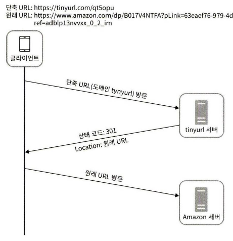
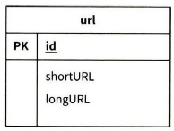
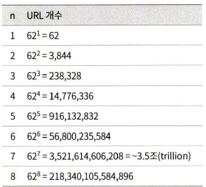

# 08 URL 단축기 설계

긴 URL을 짧은 URL로 변환해주고, 짧은 URL에 접근하면 원본 URL로 리다이렉션해주는 서비스를 설계해본다.

## 요구사항

- **트래픽**: 매일 1억 개의 단축 URL 생성. 초당 약 1,160건의 쓰기 요청 발생 ($100{,}000{,}000 \div 86{,}400 \approx 1{,}160$).
- **읽기/쓰기 비율**: 읽기 : 쓰기 = 10 : 1. 초당 읽기 요청 약 11,600건, 쓰기 요청 약 1,160건.
- **레코드 수**: 서비스 운영 기간 10년 기준 총 저장 레코드 수 = $1\text{억} \times 365 \times 10 = 3{,}650\text{억}$ 개.
- **저장 용량**: 원본 URL 평균 길이 100 bytes 기준 총 저장 용량 $\approx$ **36.5 TB**.

## API 엔드포인트 설계

URL 단축기는 기본적으로 두 개의 엔드포인트가 필요하다.

### 1. URL 단축용 엔드포인트

- `POST /api/v1/data/shorten`
- 인자: `{ longUrl: longURLstring }`
- 반환: 단축 URL

### 2. URL 리다이렉션용 엔드포인트

단축 URL로 HTTP 요청이 오면 원본 URL로 보내주기 위한 용도의 엔드포인트.

- `GET /api/v1/{shortUrl}`
- 반환: HTTP 리다이렉션 목적지가 될 원본 URL

## URL 리다이렉션

`301`과 `302`는 모두 리다이렉션 응답이지만 다음과 같은 차이가 있다.

### 1. 301 Moved Permanently

해당 URL에 대한 HTTP 요청의 처리 책임이 **영구적으로** `Location` 헤더에 반환된 URL로 이전되었다는 응답이다.

- 영구적으로 이전되었으므로, 브라우저는 이 응답을 캐시한다.
- 이후 같은 단축 URL에 요청을 보낼 필요가 있을 때 브라우저는 캐시된 원본 URL로 직접 요청을 보낸다.
- 첫 번째 요청만 단축 URL 서버로 전송되기 때문에, **서버 부하를 줄이는 것이 중요하다면 301**이 유리하다.

### 2. 302 Found

해당 URL로의 요청이 **일시적으로** `Location` 헤더가 지정하는 URL에 의해 처리되어야 한다는 응답이다.

- 클라이언트의 요청은 언제나 단축 URL 서버에 먼저 보내진 후 원본 URL로 리다이렉션 된다.
- **트래픽 분석이 중요할 때는 302**가 유리하다. 클릭 발생률이나 발생 위치를 추적하기 좋다.

## 상세 설계

### 1. 데이터 모델

리다이렉션 매핑을 해시 테이블(인메모리)로 설계하는 것은 초기 전략으로는 괜찮지만, 메모리는 유한하고 비싸기 때문에 실제 시스템에 쓰기에는 곤란하다. 따라서 `<단축 URL, 원본 URL>` 쌍을 **관계형 데이터베이스**에 저장하는 방식을 떠올릴 수 있다.

### 2. 해시 함수 길이

단축 URL의 `hashValue`는 `[0-9, a-z, A-Z]` 문자들로 구성되므로 사용할 수 있는 문자의 개수는 $10 + 26 + 26 = 62$개다.

요구사항의 레코드 수인 3,650억 개를 모두 표현할 수 있어야 하므로, $62^n \geq 3{,}650\text{억}$을 만족하는 $n$의 최솟값을 찾는다.

$n = 7$이면 약 3.5조 개의 URL을 표현할 수 있으므로, **`hashValue`의 길이는 7로 설정**하면 충분하다.

### 3. 해시 함수 구현

두 가지 방법을 살펴본다.

1. 해시 후 충돌 해소 (Hash + Resolve)
2. base-62 변환

base-62의 62진법은 `hashValue`에 사용할 수 있는 문자의 개수가 62개이기 때문이다.

#### 3-1. 해시 후 충돌 해소

해시 함수(예: MD5, SHA-1 등)를 통해 얻은 해시값의 앞 7글자만 사용하는 방법이다. 해시 결과가 서로 충돌할 가능성이 있으므로, 충돌이 해소될 때까지 사전에 정한 문자열을 원본 URL에 덧붙이고 다시 해시한다.

- **정상 플로우**: 입력(`longURL`) → 해시 함수 → `shortURL` → DB 확인 → 없으면 DB에 저장 → 종료
- **충돌 플로우**: 입력(`longURL`) → 해시 함수 → `shortURL` → DB 확인 → **충돌** → 사전에 정한 문자열 추가 → 처음부터 반복

**단점**

- 단축 URL 생성할 때마다 DB에 한 번 이상 질의를 해야 하므로 오버헤드가 크다.
- 충돌 시 루프가 돌아 지연이 예측 불가능하다.

#### 3-2. base-62 변환

유일한 ID(정수)를 먼저 생성하고, 이를 62진법으로 변환해 단축 URL로 쓰는 방식이다. 이 방식은 수의 표현 방식이 다른 두 시스템이 같은 수를 공유해야 하는 경우에 유용하다.

- **신규 생성 플로우**: 입력(`longURL`) → DB에 해당 URL 조회 → 존재하지 않음 → **유일한 ID 생성** 후 DB 기본 키로 사용 → 62진법을 적용해 ID를 단축 URL로 변환 → 클라이언트에 전달
- **조회 플로우**: 입력(`longURL`) → DB에 해당 URL 조회 → 존재함 → DB에서 해당 단축 URL을 가져와서 클라이언트에 전달

여기서 "유일한 ID 생성"은 [유일 ID 생성기](<./07_분산 시스템을 위한 유일 ID 생성기 설계.md>)에서 다룬 Snowflake, 티켓 서버 등의 방식을 활용할 수 있다.

#### 3-3. 두 접근법 비교

## 나의 생각

### 1. 데이터 분석

URL 단축 서비스는 **리다이렉션만** 담당하는 게 아니라, **분석**또한 필요하다. 각 클릭에는 비즈니스에 쓸 수 있는 데이터가 담긴다.

- 언제 클릭이 발생했는지 (시간대, 피크 등)
- 어떤 경로로 유입됐는지 (레퍼럴 등)

관련해서는 위 본문의 **301 vs 302** 선택도 연결된다. 정확한 분석을 하려면 브라우저가 매번 단축 URL 서버를 거치게 하는 **302** 쪽이 유리할 수 있다.

### 2. 클릭 카운트를 DB에서 직접 올리면 생기는 문제

가장 단순한 접근은 `short_code` 와 같은 행에 `click_count` 컬럼을 두고, 리다이렉션마다 `UPDATE ... SET click_count = click_count + 1` 하는 것이다. 소규모에는 잘 동작하지만, **인기 링크**에서는 초당 수천 건의 클릭이 같은 행으로 몰린다.

- 한 행에 대한 **연속된 `UPDATE`** → 행 단위 경합
- 트랜잭션 처리량이 급격히 떨어지고, 리다이렉션 경로까지 지연이나 타임아웃으로 번질 수 있다.

즉, **집계 카운터를 RDBMS가 실시간으로 갱신**하는 방식은 분석 목적에는 맞아 보여도, **리다이렉션의 병목**으로 바뀌기 쉽다.

### 3. Redis로 실시간 집계

Redis는 명령 단위로 원자성을 보장하기 때문에 `INCR`와 같은 연산을 별도의 락 없이도 안전하게 수행할 수 있다.
내부적으로는 단일 스레드 이벤트 루프에서 명령이 순차적으로 실행되므로, 동일 키에 대한 경쟁 상황에서도 race condition이 발생하지 않는다.

1. 리다이렉션 할 때 이벤트 데이터를 Redis 리스트에 기록
2. Worker가 일정 주기(5초)나 갯수(100개)를 기준으로 이벤트 consume
3. 배치로 묶어 Postgresql 분석용 테이블에 bulk insert
4. 이후 배치 작업(Spring Batch)등을 통해 시간/일별 통계 집계
