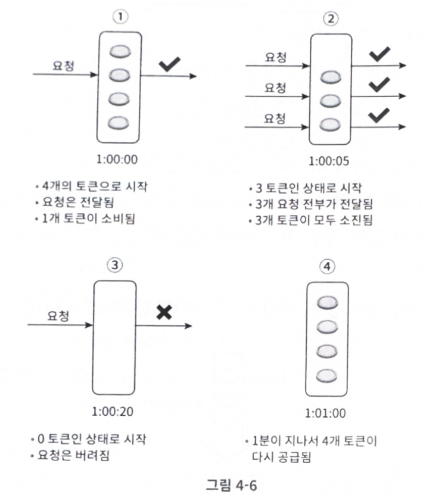
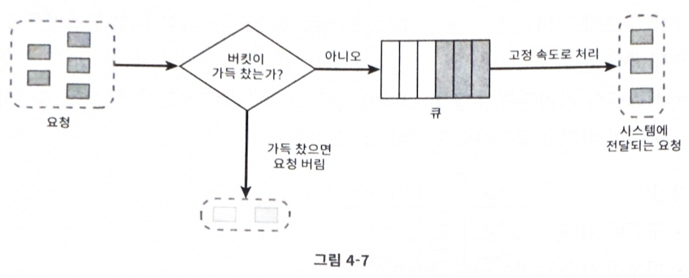
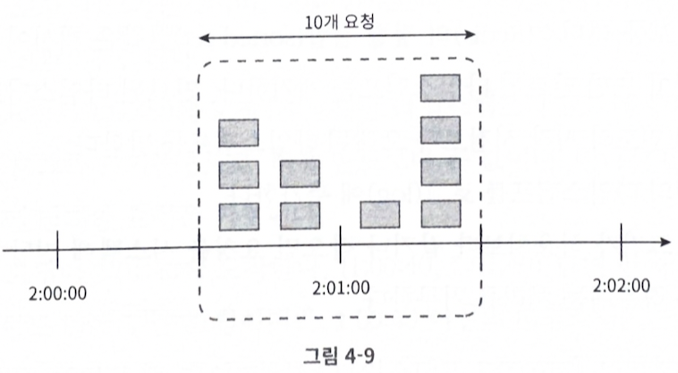
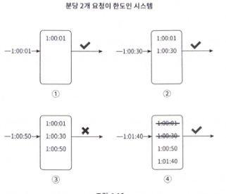
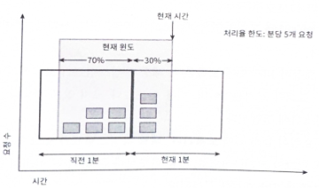
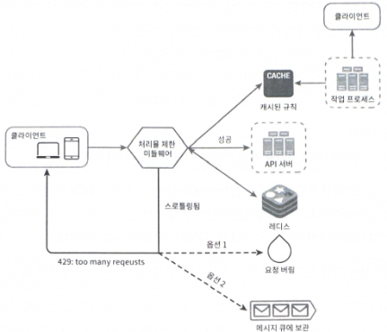

# 처리율 제한 장치 (Rate Limiter)

처리율 제한 장치는 클라이언트나 서비스가 보내는 트래픽을 일정 한도로 제어하는 컴포넌트다. 다음과 같은 사례에서 활용된다.

- 사용자는 **초당 2회** 이상 새 글을 올릴 수 없다.
- 같은 IP 주소로는 **하루 10개** 이상의 계정을 생성할 수 없다.
- 같은 디바이스로는 **주당 5회** 이상 리워드를 요청할 수 없다.

API에 처리율 제한 장치를 두면 다음과 같은 이점이 있다.

- **DoS에 의한 자원 고갈 방지**
- **비용 절감** (계산 자원, 외부 API 호출 비용 등)
- **서버 과부하 방지**

## 요구사항

- 설정된 처리율을 **초과하는 요청은 정확히 제한**한다.
- **낮은 응답 시간**: 처리율 제한 장치가 HTTP 응답 시간에 부정적 영향을 주지 말아야 한다.
- 가능한 한 **적은 메모리**를 사용한다.
- **분산 환경 지원**: 하나의 처리율 제한 장치를 여러 서버/프로세스에서 공유할 수 있어야 한다.
- **명확한 예외 처리**: 요청이 제한되었을 때 그 사실을 사용자에게 분명히 전달해야 한다.
- **높은 결함 감내성**: 제한 장치에 장애가 생기더라도 전체 시스템에 영향을 주지 말아야 한다.

## 처리율 제한 장치의 위치

| 위치 | 특징 |
|---|---|
| **클라이언트 측** | 위변조가 쉬워 권장하지 않는다. |
| **서버 측** | 요청을 중앙화해서 관리한다. |
| **미들웨어** | API Gateway(처리율 제한, 사용자 인증, IP 허용 목록 등)와 같은 곳에 구현한다. |

### 위치 선택 시 고려할 점

- 현재 **기술 스택**이 서버 측 구현을 효율적으로 지원할 수 있는가?
- 상황에 맞는 **알고리즘**을 선택할 수 있는가? 서드파티 게이트웨이를 쓰면 선택지가 제한될 수 있다.
- **MSA 기반**이라 인증/IP 허용 같은 기능이 이미 API Gateway에 있다면, 처리율 제한도 그곳에 두는 것이 자연스럽다.
- 처리율 제한 장치를 직접 구현하는 데도 비용이 든다. 인력이 부족하다면 **상용 솔루션**도 고려할 만하다.

## 처리율 제한 알고리즘

### 1. 토큰 버킷 (Token Bucket)

**동작 방식**

- 주기적으로 토큰 버킷에 토큰이 채워진다.
- 버킷이 가득 차면 더 이상 토큰을 추가하지 않는다.
- 각 요청은 처리될 때마다 토큰 1개를 소비한다.
- 토큰이 부족하면 해당 요청은 버려진다.

**두 개의 인자**

- **버킷 크기**: 버킷에 담을 수 있는 토큰의 최대 개수
- **토큰 공급률**: 초당 몇 개의 토큰이 버킷에 공급되는가

**버킷 할당 전략**

- 통상 **API 엔드포인트마다 별도의 버킷**을 둔다.
- IP 주소별로 처리율을 제한해야 한다면 **IP마다 버킷을 하나씩** 할당한다.
- 시스템 전체 처리율을 초당 10,000개로 제한한다면 **모든 요청이 하나의 버킷을 공유**한다.

**장점**

- 구현이 쉽다.
- 메모리 효율이 좋다.
- **버스트 트래픽**에 대응 가능하다. 버킷에 토큰이 남아 있는 한 모든 요청이 시스템에 전달된다.

**단점**

- 버킷 크기와 토큰 공급률이라는 **두 인자의 튜닝**이 까다롭다.

### 2. 누출 버킷 (Leaky Bucket)

요청 처리율이 **고정**되어 있다는 점에서 토큰 버킷과 다르다. 보통 FIFO 큐로 구현한다.

**동작 방식**

- 요청이 도착하면 큐가 가득 찼는지 확인한다. 빈 자리가 있으면 큐에 추가한다.
- 큐가 가득 차 있으면 요청은 버린다.
- 지정된 시간마다 큐에서 요청을 꺼내 처리한다.

**두 개의 인자**

- **버킷 크기**: 큐 사이즈
- **처리율**: 단위 시간당 처리할 항목 수 (보통 초 단위)

**장점**

- 큐 크기가 제한되어 있어 메모리 효율이 좋다.
- 고정된 처리율을 보장하므로 **안정적 출력**이 필요한 경우에 적합하다.

**단점**

- 단시간에 버스트 트래픽이 몰리면 큐에 오래된 요청들이 쌓이고, **최신 요청이 버려질** 수 있다.
- 두 인자의 튜닝이 까다롭다.

### 3. 고정 윈도 카운터 (Fixed Window Counter)

**동작 방식**

- 타임라인을 고정된 간격의 **윈도우**로 나누고, 각 윈도우마다 카운터를 둔다.
- 요청이 들어올 때마다 카운터가 1씩 증가한다.
- 카운터가 임계치에 도달하면, 새 윈도우가 열릴 때까지 이후 요청은 버려진다.

**장점**

- 메모리 효율이 좋다.
- 이해하기 쉽다.
- 윈도우 종료 시 카운터를 초기화하는 방식은 특정한 트래픽 패턴에 적합하다.

**단점**

- **윈도우 경계 부근에서 트래픽이 몰리면**, 시스템의 처리 한도보다 더 많은 요청을 처리하게 된다.

**경계 문제 예시**

분당 최대 5개의 요청을 처리한다고 했을 때,

- `2:00:00 ~ 2:01:00` 관점에서는 1분 동안 5개를 처리한 것으로 보이지만,
- `2:00:30 ~ 2:01:30` 관점에서는 같은 1분 동안 **10개**를 처리한 셈이 된다.

### 4. 이동 윈도 로깅 (Sliding Window Log)

고정 윈도 카운터의 경계 문제를 해결하는 알고리즘이다.

**동작 방식**

- 요청의 **타임스탬프를 추적**한다. 보통 Redis의 Sorted Set에 보관한다.
- 새 요청이 오면 **만료된 타임스탬프**(현재 윈도우 시작 시점보다 오래된 것)를 제거한다.
- 새 요청의 타임스탬프를 로그에 추가한다.
- 로그 크기가 허용치 이하면 요청을 통과시키고, 그렇지 않으면 거부한다.

**장점**

- 매우 정교하다. **어느 순간의 윈도우를 봐도 처리율 한도를 넘지 않는다.**

**단점**

- **거부된 요청의 타임스탬프도 보관**하기 때문에 메모리 사용량이 많다.

### 5. 이동 윈도 카운터 (Sliding Window Counter)

고정 윈도 카운터와 이동 윈도 로깅을 **결합한 방식**이다.

**동작 방식**

한도가 분당 7개이고, 직전 1분간 5개의 요청이, 현재 1분간 3개의 요청이 있었다고 하자. 이동 윈도우가 직전 1분과 70% 겹친다면 다음과 같이 추정한다.

현재 윈도우 요청 수 = 3 + 5 * 70% = 6.5 (반올림 또는 내림 처리가 가능하다.)

**장점**

- 직전 시간대의 평균 처리율을 활용하므로 **버스트 트래픽에도 잘 대응**한다.
- 메모리 효율이 좋다.

**단점**

- 직전 시간대의 요청이 **균등 분포**라고 가정하므로 100% 정확하지는 않다.
- Cloudflare 실험에 따르면, 40억 개 요청 중 오탐률은 약 **0.003%**에 불과했다고 한다.

### 알고리즘 비교

| 알고리즘 | 버스트 대응 | 메모리 | 정확도 | 비고 |
|---|---|---|---|---|
| 토큰 버킷 | O | 적음 | 보통 | 인자 튜닝 까다로움 |
| 누출 버킷 | X | 적음 | 보통 | 안정적 출력 보장 |
| 고정 윈도 카운터 | X | 매우 적음 | **경계 문제** | 단순함 |
| 이동 윈도 로깅 | O | **많음** | **정확** | 거부 요청도 저장 |
| 이동 윈도 카운터 | O | 적음 | 근사적으로 정확 | 실무에서 자주 쓰임 |

## 개략적인 아키텍처

카운터를 어디에 보관할까? **DB는 디스크 접근 때문에 느려서 적절하지 않고**, **Redis** 같은 인메모리 캐시가 바람직하다. 빠르고, 시간 기반 만료 정책을 지원하기 때문이다.

- `INCR`: 메모리에 저장된 카운터 값을 1만큼 증가시킨다.
- `EXPIRE`: 카운터에 타임아웃을 설정한다. 시간이 지나면 자동 삭제된다.

**동작 흐름**

1. 클라이언트가 처리율 제한 미들웨어로 요청을 보낸다.
2. 미들웨어는 Redis의 지정 버킷에서 카운터를 가져와 한도 도달 여부를 검사한다.
   - **한도 도달**: 요청 거부
   - **한도 미도달**: 요청을 API 서버로 전달, 카운터를 증가시킨 후 Redis에 다시 저장

## 상세 설계

### 처리율 한도 초과 트래픽 처리

- **HTTP 429 Too Many Requests** 응답을 클라이언트에 보낸다.
- 경우에 따라 한도에 걸린 메시지를 나중에 처리하기 위해 **큐에 보관**할 수도 있다.

### 처리율 제한 관련 HTTP 헤더

클라이언트가 자기 요청이 처리율 제한에 걸리고 있는지 다음 헤더를 통해 확인할 수 있다.

| 헤더 | 의미 |
|---|---|
| `X-Ratelimit-Remaining` | 윈도 내에 남은 처리 가능 요청 수 |
| `X-Ratelimit-Limit` | 매 윈도마다 클라이언트가 보낼 수 있는 요청 수 |
| `X-Ratelimit-Retry-After` | 한도에 걸리지 않으려면 몇 초 뒤에 다시 보내야 하는지 |

> 헤더 앞의 `X-`는 커스텀 헤더라는 뜻이다.

사용자가 너무 많은 요청을 보내면 `429 Too Many Requests` 오류와 `X-Ratelimit-Retry-After` 헤더를 함께 반환한다.

### 전체 흐름

- 처리율 제한 **규칙은 디스크에 보관**하며, 워커가 수시로 디스크에서 규칙을 읽어 캐시에 적재한다.
- 클라이언트 요청은 먼저 **처리율 제한 미들웨어**로 보내진다.
- 미들웨어는 캐시에서 제한 규칙과 카운터, 마지막 요청 타임스탬프를 가져와 검사한다.
  - 제한에 걸리지 않으면 API 서버로 전달
  - 제한에 걸리면 `429`를 반환. 요청은 버리거나 메시지 큐에 보관

## 분산 환경에서의 구현

분산 환경에서는 **경쟁 조건**과 **동기화** 두 가지 문제를 해결해야 한다.

### 1. 경쟁 조건 (Race Condition)

처리율 제한 장치는 다음과 같이 동작한다.

1. Redis에서 카운터 값을 읽는다.
2. `counter + 1`이 임계치를 넘는지 확인한다.
3. 넘지 않는다면 Redis의 카운터를 1 증가시킨다.

병행성이 높은 환경에서는 `counter`가 3인 상황에 두 요청이 동시에 들어왔을 때, 각 스레드가 병렬로 읽고 증가시켜 **5가 아닌 4**로 잘못 갱신될 수 있다.

**해결책**

- **락(Lock)**: 가장 널리 알려진 방식이지만, **시스템 성능을 크게 떨어뜨릴 수 있다**.
- **Lua Script** 또는 **Sorted Set**을 활용해 원자성을 확보한다.

### 2. 동기화 이슈

수백만 사용자를 지원하려면 한 대의 처리율 제한 서버로는 충분하지 않다. 서버를 여러 대 두면 **상태 동기화**가 필요하다. 웹 계층은 무상태이므로, 동기화 없이는 서로 다른 서버로 가는 동일 클라이언트의 요청에 대해 일관된 처리율 제한을 적용할 수 없다.

**해결 방법**

- **Sticky Session**: 같은 클라이언트의 요청을 항상 같은 처리율 제한 장치로 보낸다. 단, 규모 확장성이 떨어지고 유연하지 않다.
- **중앙 집중형 데이터 저장소(Redis 등)**: 모든 처리율 제한 장치가 같은 저장소를 참조한다. **권장되는 방식**.

### 3. 성능 최적화

- 데이터센터에서 멀리 떨어진 사용자의 경우 **지연 시간이 증가**한다.
- 트래픽을 가장 가까운 **Edge Server**로 라우팅해 지연을 줄인다.
- 제한 장치 간 데이터 동기화는 **최종 일관성(Eventual Consistency)** 모델을 사용한다.

## 모니터링

처리율 제한 장치가 효과적으로 동작하는지 확인하려면 다음 두 가지를 검증할 수 있는 데이터를 모아야 한다.

- 채택된 **알고리즘**이 효과적인가?
- 정의된 **제한 규칙**이 효과적인가?

깜짝 세일과 같은 트래픽 급증 상황에서 현재 장치가 비효율적이라면 다른 알고리즘을 검토한다. 이런 상황에는 **토큰 버킷**이 적합하다.

## 마무리

### 경성 vs 연성 처리율 제한

- **경성 처리율 제한 (Hard)**: 요청 개수가 임계치를 **절대** 넘지 않는다.
- **연성 처리율 제한 (Soft)**: 요청 개수가 잠시 동안 임계치를 **넘어설 수 있다**.

### 다양한 계층에서의 처리율 제한

- 애플리케이션 계층(L7)뿐 아니라, **iptables**를 사용해 IP 주소(L3)에서도 처리율 제한을 적용할 수 있다.

### 처리율 제한 회피

- **클라이언트 캐시**를 사용해 API 호출 횟수를 줄인다.
- 예외와 에러 처리 코드를 도입해 **예외적 상황에서도 잘 복구**되도록 한다.
- 재시도 로직에는 충분한 **backoff 시간**을 둔다.

## 나의 생각

### Rate Limiter 자체가 다운되면 어떻게 해야 할까?

요구사항에는 **"결함 감내성"** 이 적혀 있지만, 정작 *장애가 발생했을 때 어떤 방향으로 행동해야 하는가*는 명시되어 있지 않다. 이 선택은 단순한 엔지니어링 결정이 아니라, **서비스의 성격과 비즈니스 가치에 따라 달라지는 의사결정**에 가깝다.

#### Fail Open

Rate Limiter가 다운되면 **모든 요청을 통과**시키는 방식이다.

- 사용자 경험은 지켜지지만, **백엔드가 보호 장치 없이 노출**된다.
- Rate Limiter의 장애가 곧 과부하로 이어질 위험이 있다.
- 비교적 **영향 범위가 작은 엔드포인트**(상품 목록, 카테고리 조회 등)에 적합하다.

#### Fail Closed

Rate Limiter가 다운되면 **모든 요청을 거부**하는 방식이다.

- 백엔드는 안전하지만, **Rate Limiter의 장애가 곧 전체 가용성 붕괴**로 직결된다.
- **결제 API나 write-heavy 작업**처럼, 잘못 통과되었을 때의 비용이 큰 경우에 적합하다.

#### 절충안: 계층화된 Fail Open

둘 중 하나만 고를 필요는 없다고 생각한다. **외부 Rate Limiter가 다운되면 로컬 Rate Limiter로 Fallback**해, 장애가 회복될 때까지 보수적인 한도로 일부 트래픽만 허용하는 방식을 떠올려 볼 수 있다.

- 장점: 사용자 경험과 백엔드 보호를 **합리적인 지점**에서 절충할 수 있다.
- 단점: 로컬과 외부 중앙 Rate Limiter의 한도가 다르므로, Fallback 중에는 **정확한 처리율 보장이 어렵다**. 일관성을 일부 포기하는 대신 가용성을 얻는 트레이드오프다.

결국 Fail Open / Fail Closed의 선택은 **이 엔드포인트는 잘못 통과되는 게 더 위험한가, 잘못 막히는 게 더 위험한가** 라는 질문으로 환원된다. 시스템 전체에 한 가지 정책을 강제하기보다, **엔드포인트 성격별로 다르게** 정의하는 것이 더 현실적인 접근이라고 생각한다.