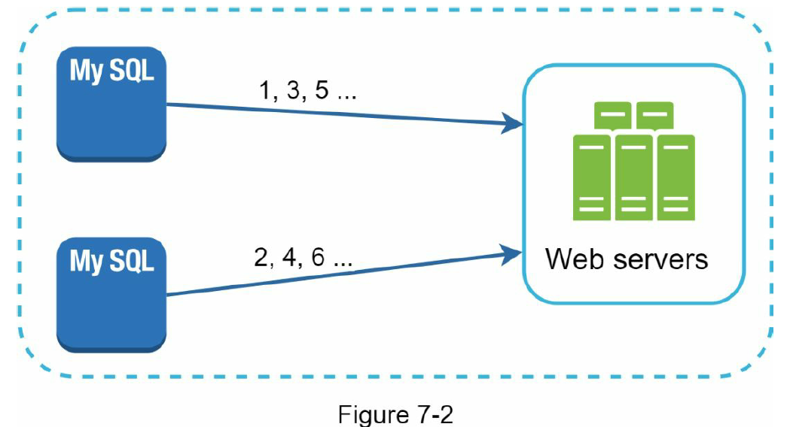
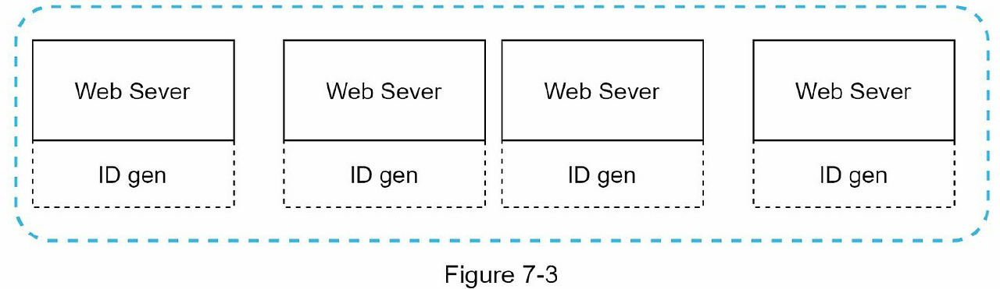
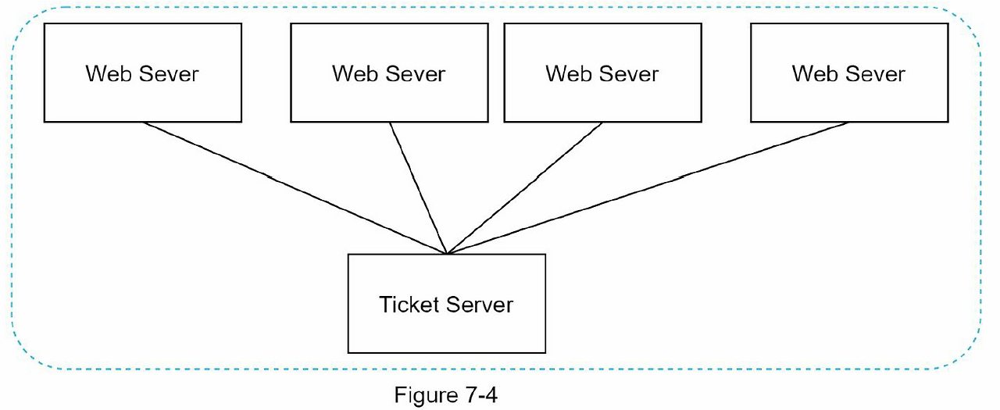
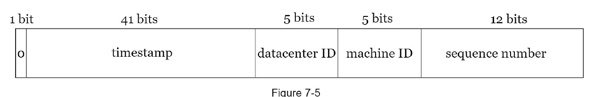

# 분산 시스템에서의 유일 ID

분산 시스템에서 유일 ID를 어떻게 만들지 고민해본다.

`auto_increment` 속성이 설정된 관계형 데이터베이스의 기본 키를 쓰면 되지 않을까 생각할 수 있지만, 분산 환경에서는 이러한 접근이 잘 통하지 않는다. DB 서버 한 대로는 요구량을 감당할 수 없고, 여러 DB 서버를 쓰자니 지연 시간을 낮추기도 어렵다.

## 요구사항

다음과 같은 요구사항이 있다고 가정해본다.

- ID는 유일해야 한다.
- ID는 숫자로만 구성되어야 한다.
- ID는 64비트로 표현될 수 있는 값이어야 한다.
- ID는 발급 날짜에 따라 정렬 가능해야 한다.
- 초당 10,000개의 ID를 만들 수 있어야 한다.

## 1. 다중 마스터 복제 (Multi-Master Replication)



DB의 `auto_increment`를 활용하되, 다음 ID를 1씩 증가시키는 게 아니라 데이터베이스 서버의 수(k)만큼 증가시킨다. DB 수를 늘리면 초당 생성 가능한 ID 수를 늘릴 수 있으므로 규모 확장성 문제는 어느 정도 해결된다.

하지만 다음과 같은 문제가 있다.

- 여러 데이터 센터에 걸쳐 규모를 늘리기 어렵다.
- ID의 유일성은 보장되지만, 값이 시간 흐름에 맞추어 커지도록 보장할 수는 없다.
- 서버를 추가하거나 삭제할 때 잘 동작하도록 만들기 어렵다.

## 2. UUID



웹 서버마다 128비트짜리 UUID를 만든다. UUID는 충돌 가능성이 지극히 낮다.

**장점**

- 단순하다. 서버 사이의 조율이 필요 없으므로 동기화 이슈도 없다.
- 각 서버가 자기가 쓸 ID를 알아서 만드므로 규모 확장이 쉽다.

**단점**

- 요구 사항은 64비트이지만 UUID는 128비트이다.
- ID를 시간순으로 정렬할 수 없다.
- ID에 숫자가 아닌 값이 포함될 수 있다.

## 3. 티켓 서버 (Ticket Server)



`auto_increment` 기능을 갖춘 데이터베이스 서버, 즉 티켓 서버를 중앙 집중형으로 하나만 사용한다. Flickr는 분산 기본 키를 만들기 위해 이 기술을 이용했다.

**장점**

- 유일성이 보장되고, 숫자로만 구성된 ID를 쉽게 만들 수 있다.
- 구현하기 쉽고, 중소 규모 애플리케이션에 적합하다.

**단점**

- 티켓 서버가 SPOF(Single Point of Failure)가 된다. 이 서버에 장애가 발생하면, 해당 서버를 이용하는 모든 시스템이 영향을 받는다.
- 이 이슈를 피하려면 티켓 서버를 여러 대 준비해야 하는데, 그러면 데이터 동기화라는 새로운 문제가 발생한다.

## 4. Twitter Snowflake



생성하는 ID의 구조를 여러 절(section)로 분리한다.

- **사인 비트 (1bit)**: 지금은 쓰임새가 없지만 나중을 위해 유보.
- **타임스탬프 (41bit)**: 기원 시각(epoch) 이후 경과한 밀리초. 기원 시각은 보통 서비스 시작 시점으로 잡으며, 41비트이므로 약 69년을 커버한다.
- **데이터센터 (5bit)**: 32개의 데이터 센터 지원 가능.
- **서버 ID (5bit)**: 데이터센터당 32개 서버 사용 가능.
- **일련번호 (12bit)**: 각 서버에서 ID를 생성할 때마다 1씩 증가하고, 1밀리초가 경과할 때마다 0으로 초기화된다.

### 4-1. 나의 생각

Snowflake 기준 41비트 타임스탬프는 69년을 커버하는데, 서비스가 69년 이상 운영된다면 어떻게 해야 할까?

(물론 서비스가 69년만 운영되어도 정말 멋진 일이다!!)

**1) epoch 변경 (기준점을 현재로 다시 잡음)**

- 하위호환성을 생각해야 할 텐데, 첫 번째 사인 비트를 `0: v1`, `1: v2` 식으로 버전 플래그처럼 관리하는 방식을 생각해 보았다.
- 구조 자체는 단순하지만, 대부분의 DB/언어가 64비트 정수를 **signed**로 해석한다는 점이 걸림돌이다.
  - 사인 비트를 1로 켜는 순간 ID가 음수로 해석되어 `ORDER BY id`가 뒤집힌다 (최신 v2가 앞으로 옴).
  - MySQL의 `BIGINT UNSIGNED`처럼 unsigned 타입으로 강제하거나, 애플리케이션 전반에서 unsigned 비교를 약속해야 한다. Snowflake가 최상위 비트를 비워둔 이유이기도 한 것 같다.
- ID에서 timestamp를 뽑아내는 디코더에도 v1/v2 분기가 생긴다. 복잡하진 않지만, ID를 파싱하는 모든 툴에 일관되게 퍼뜨려야 한다.

**2) 일련번호 비트를 타임스탬프로 옮기기**

- 일련번호는 4096개 값을 가지는데, 이는 1ms 내에서만 유효한 값이다. 1ms 안에 동시에 생성되는 경우에만 일련번호가 증가한다.
- 1ms당 4096개면 1초당 4,096,000개 처리가 가능한데, 서버 ID가 별도로 존재하므로 절반으로 줄여도 괜찮을 것 같다. (서버마다 1ms당 2,048개, 전체적으로 1초당 2,048,000개 처리)
- 일련번호에서 1비트를 타임스탬프로 떼오면 69년 → 138년으로 연장할 수 있다.

**3) 128비트로 늘리기**

- CPU가 네이티브하게 처리하는 정수는 64비트까지이므로, 언어 레벨에서도 성능이 떨어질 수 있다. (`BigInteger`, `big.Int` 등)
- Redis에 key로 잡는 경우를 생각해봐도, 64비트로 저장하면 정수 최적화가 되지만 128비트면 메모리 사용량이 커지고 연산이 느려질 수 있다.

## 5. Instagram

참고: [Sharding & IDs at Instagram](https://instagram-engineering.com/sharding-ids-at-instagram-1cf5a71e5a5c)

2012년에 작성된 글이라 조금 오래되었지만 비슷한 고민을 한 흔적이 보여 함께 정리하게 되었다.

Instagram은 매일 수백만 장의 사진이 업로드되는 환경에서, PostgreSQL을 샤딩하여 데이터를 분산 저장해야 했다. 이때 ID 생성이 갖추어야 할 요구사항은 다음과 같았다.

- 생성된 ID는 시간순으로 정렬 가능해야 한다 (별도의 정보 조회 없이 `ORDER BY id`만으로 정렬 가능).
- ID는 64비트로 표현되어야 한다. (인덱스 크기 및 Redis 같은 저장소에서의 효율성을 위해)
- 최대한 단순하고, 기존 인프라에 새로운 컴포넌트를 추가하지 않아야 한다.

### 채택한 방식: DB 안에서 ID를 생성

Instagram은 **PostgreSQL의 PL/pgSQL 저장 프로시저**로 각 샤드 내부에서 ID를 직접 만들도록 했다. 별도의 ID 생성 서버 없이, 데이터가 들어가는 바로 그 샤드에서 ID가 발급된다.

ID 구조는 64비트를 다음과 같이 나누어 쓴다.

- **타임스탬프 (41bit)**: 커스텀 epoch 이후 경과한 밀리초. 
> 원문에는 "41 years"로 적혀 있지만 실제로는 Snowflake와 동일하게 약 69년을 커버한다. (원문의 오탈자로 보인다.) 

- **샤드 ID (13bit)**: 논리 샤드 번호. 최대 8,192개의 논리 샤드 표현 가능.
- **일련번호 (10bit)**: 샤드별 시퀀스를 1024로 나눈 나머지. 같은 샤드에서 1ms 내 최대 1,024개의 ID 생성 가능.

### PL/pgSQL 구현

```sql
CREATE OR REPLACE FUNCTION insta5.next_id(OUT result bigint) AS $$
DECLARE
    our_epoch  bigint := 1314220021721;
    seq_id     bigint;
    now_millis bigint;
    shard_id   int := 5;
BEGIN
    SELECT nextval('insta5.table_id_seq') %% 1024 INTO seq_id;
    SELECT FLOOR(EXTRACT(EPOCH FROM clock_timestamp()) * 1000) INTO now_millis;

    result := (now_millis - our_epoch) << 23;
    result := result | (shard_id << 10);
    result := result | (seq_id);
END;
$$ LANGUAGE PLPGSQL;
```

테이블에 row가 insert될 때 `DEFAULT next_id()`를 통해 자동으로 ID가 채워진다.

### 특징

- **시간순 정렬이 자연스럽다**: 최상위 비트가 타임스탬프이므로, `ORDER BY id`가 곧 `ORDER BY created_at`이 된다. 별도의 created_at 인덱스가 필요 없다.
- **ID만 봐도 어느 샤드에 있는지 알 수 있다**: ID의 중간 13비트가 샤드 번호이므로, 애플리케이션이 ID에서 직접 샤드를 찾아갈 수 있다.
- **새로운 인프라가 필요 없다**: ID 생성이 DB 내부에서 일어나기 때문에, 별도의 ID 서버/조율 서비스가 필요 없다. 각 샤드가 독립적으로 ID를 만든다.
- **충돌 없음**: 같은 샤드/같은 밀리초 안에서도 sequence로 구분되고, 샤드 간에는 shard_id로 구분된다.

### Snowflake와의 비교

| 항목 | Snowflake (Twitter) | Instagram |
|---|---|---|
| 타임스탬프 | 41bit | 41bit |
| 머신/샤드 식별 | 데이터센터 5bit + 서버 ID 5bit (=10bit) | 샤드 ID 13bit |
| 일련번호 | 12bit (1ms당 4,096개) | 10bit (1ms당 1,024개) |
| 생성 주체 | 전용 ID 생성 서버 | 각 DB 샤드 내부 (PL/pgSQL) |
| 운영 컴포넌트 | 별도의 ID 서비스 필요 | DB가 ID 생성기 |

Instagram은 "물리 머신"이 아니라 "논리 샤드" 단위로 공간을 할당한 점, 그리고 **애플리케이션 외부에서 ID를 조율하지 않고 DB 안에서 해결**했다는 점이 Snowflake와 구분되는 철학적 차이라고 볼 수 있다.

### 5-1. 나의 생각

**1) 핫스팟 문제**

Instagram은 ID 생성이 샤드 단위로 묶여 있으므로 특정 샤드에 트래픽이 집중되면 한계에 빠르게 도달할 것 같다. (1024/ms)
이런 문제에 대한 해결책이 보이지 않아 다소 아쉬웠다.

**2) 샤드 분할**

만약 shard 5에 있던 걸 shard 5-1, 5-2로 나누게 되면 ID에는 shard_id가 5로 이미 저장이 되어 있을텐데, 실제 데이터 위치와의 불일치는 어떤 식으로 해결할까?