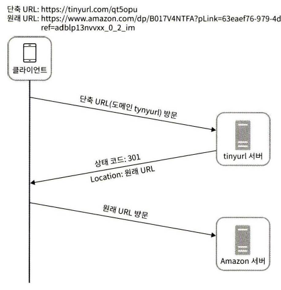
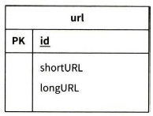
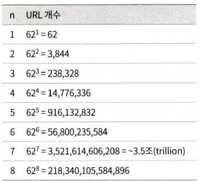

# URL 단축기

긴 URL을 짧은 URL로 변환해주고, 짧은 URL에 접근하면 원본 URL로 리다이렉션해주는 서비스를 설계해본다.

## 요구사항

- **트래픽**: 매일 1억 개의 단축 URL 생성. 초당 약 1,160건의 쓰기 요청 발생 ($100{,}000{,}000 \div 86{,}400 \approx 1{,}160$).
- **읽기/쓰기 비율**: 읽기 : 쓰기 = 10 : 1. 초당 읽기 요청 약 11,600건, 쓰기 요청 약 1,160건.
- **레코드 수**: 서비스 운영 기간 10년 기준 총 저장 레코드 수 = $1\text{억} \times 365 \times 10 = 3{,}650\text{억}$ 개.
- **저장 용량**: 원본 URL 평균 길이 100 bytes 기준 총 저장 용량 $\approx$ **36.5 TB**.

## API 엔드포인트 설계

URL 단축기는 기본적으로 두 개의 엔드포인트가 필요하다.

### 1. URL 단축용 엔드포인트

- `POST /api/v1/data/shorten`
- 인자: `{ longUrl: longURLstring }`
- 반환: 단축 URL

### 2. URL 리다이렉션용 엔드포인트

단축 URL로 HTTP 요청이 오면 원본 URL로 보내주기 위한 용도의 엔드포인트.

- `GET /api/v1/{shortUrl}`
- 반환: HTTP 리다이렉션 목적지가 될 원본 URL

## URL 리다이렉션

`301`과 `302`는 모두 리다이렉션 응답이지만 다음과 같은 차이가 있다.

### 1. 301 Moved Permanently

해당 URL에 대한 HTTP 요청의 처리 책임이 **영구적으로** `Location` 헤더에 반환된 URL로 이전되었다는 응답이다.

- 영구적으로 이전되었으므로, 브라우저는 이 응답을 캐시한다.
- 이후 같은 단축 URL에 요청을 보낼 필요가 있을 때 브라우저는 캐시된 원본 URL로 직접 요청을 보낸다.
- 첫 번째 요청만 단축 URL 서버로 전송되기 때문에, **서버 부하를 줄이는 것이 중요하다면 301**이 유리하다.

### 2. 302 Found

해당 URL로의 요청이 **일시적으로** `Location` 헤더가 지정하는 URL에 의해 처리되어야 한다는 응답이다.

- 클라이언트의 요청은 언제나 단축 URL 서버에 먼저 보내진 후 원본 URL로 리다이렉션 된다.
- **트래픽 분석이 중요할 때는 302**가 유리하다. 클릭 발생률이나 발생 위치를 추적하기 좋다.

## 상세 설계

### 1. 데이터 모델

리다이렉션 매핑을 해시 테이블(인메모리)로 설계하는 것은 초기 전략으로는 괜찮지만, 메모리는 유한하고 비싸기 때문에 실제 시스템에 쓰기에는 곤란하다. 따라서 `<단축 URL, 원본 URL>` 쌍을 **관계형 데이터베이스**에 저장하는 방식을 떠올릴 수 있다.

### 2. 해시 함수 길이

단축 URL의 `hashValue`는 `[0-9, a-z, A-Z]` 문자들로 구성되므로 사용할 수 있는 문자의 개수는 $10 + 26 + 26 = 62$개다.

요구사항의 레코드 수인 3,650억 개를 모두 표현할 수 있어야 하므로, $62^n \geq 3{,}650\text{억}$을 만족하는 $n$의 최솟값을 찾는다.

$n = 7$이면 약 3.5조 개의 URL을 표현할 수 있으므로, **`hashValue`의 길이는 7로 설정**하면 충분하다.

### 3. 해시 함수 구현

두 가지 방법을 살펴본다.

1. 해시 후 충돌 해소 (Hash + Resolve)
2. base-62 변환

base-62의 62진법은 `hashValue`에 사용할 수 있는 문자의 개수가 62개이기 때문이다.

#### 3-1. 해시 후 충돌 해소

해시 함수(예: MD5, SHA-1 등)를 통해 얻은 해시값의 앞 7글자만 사용하는 방법이다. 해시 결과가 서로 충돌할 가능성이 있으므로, 충돌이 해소될 때까지 사전에 정한 문자열을 원본 URL에 덧붙이고 다시 해시한다.

- **정상 플로우**: 입력(`longURL`) → 해시 함수 → `shortURL` → DB 확인 → 없으면 DB에 저장 → 종료
- **충돌 플로우**: 입력(`longURL`) → 해시 함수 → `shortURL` → DB 확인 → **충돌** → 사전에 정한 문자열 추가 → 처음부터 반복

**단점**

- 단축 URL 생성할 때마다 DB에 한 번 이상 질의를 해야 하므로 오버헤드가 크다.
- 충돌 시 루프가 돌아 지연이 예측 불가능하다.

#### 3-2. base-62 변환

유일한 ID(정수)를 먼저 생성하고, 이를 62진법으로 변환해 단축 URL로 쓰는 방식이다. 이 방식은 수의 표현 방식이 다른 두 시스템이 같은 수를 공유해야 하는 경우에 유용하다.

- **신규 생성 플로우**: 입력(`longURL`) → DB에 해당 URL 조회 → 존재하지 않음 → **유일한 ID 생성** 후 DB 기본 키로 사용 → 62진법을 적용해 ID를 단축 URL로 변환 → 클라이언트에 전달
- **조회 플로우**: 입력(`longURL`) → DB에 해당 URL 조회 → 존재함 → DB에서 해당 단축 URL을 가져와서 클라이언트에 전달

여기서 "유일한 ID 생성"은 [유일 ID 생성기](./unique_id.md)에서 다룬 Snowflake, 티켓 서버 등의 방식을 활용할 수 있다.

#### 3-3. 두 접근법 비교

## 나의 생각

### 1. 캐시

이런 서비스를 사용할 때는 로드 밸런서나 Redis에 캐싱을 하는 걸 떠올릴 수 있다.
요구사항에서도 읽기:쓰기가 10:1의 비율로 발생하므로 캐싱을 하는 게 대부분의 경우에 유리할 것이다.

URL 단축기의 특성상 트래픽이 단기간에 많이 몰리는 성격에 가까울 것 같다.
보통 회사 홈페이지와 같이 주소를 일부러 노출하기 위한 경우는 URL 단축기를 사용하지 않을 것이고,
글자 수의 제한이 있는 플랫폼(문자 메시지, SNS 등)에서 많이 사용할 것이기 때문이다.

그렇다면 어떤 캐시 알고리즘을 사용하는 게 좋을까?

#### LRU (Least Recently Used)

가장 먼저 떠오르는 건 LRU이다. 하지만 URL 단축기 트래픽 특성을 생각하면 두 가지가 걸린다.

- **Cache Pollution**: 핵심 데이터(A, B, C)가 캐시에 있는 상태에서 일회성 데이터(X, Y, Z)가 대량으로 유입되면, 최근성만 보고 밀어내는 LRU 특성상 핵심 데이터가 전부 일회성 데이터로 교체될 수 있다. 그 결과 캐시 히트율이 급격하게 떨어진다.

#### LFU (Least Frequently Used)

다음 후보는 LFU이다. 빈도가 낮은 항목부터 내보내므로 일회성 트래픽에 밀리진 않는다. 다만 다른 문제가 있다.

- **Stale Data**: 과거에 크게 유행했던 URL이 지금은 거의 조회되지 않아도, 누적 카운트가 높아 캐시에서 제거되지 않는다. 그 결과 **지금 막 인기가 많아진 새 URL이 캐시에 진입조차 못 하는** 상황이 발생한다. URL 단축기처럼 "바이럴 → 소멸" 사이클이 뚜렷한 워크로드에선 치명적이다.

#### TinyLFU

그래서 URL 단축기의 트래픽 특성에는 **TinyLFU** 계열이 더 잘 맞을 것 같다. 
작동 방식을 간단히 정리하면 다음과 같다.

2. **Admission Filter**: 새 항목이 들어올 때, 현재 캐시에서 쫓겨날 후보의 추정 빈도와 비교한다. **새 항목의 빈도가 더 높을 때만 캐시에 올린다.** → 일회성 데이터가 핵심 데이터를 밀어내는 LRU의 Cache Pollution를 해결한다.
3. **Aging**: 일정 주기마다 모든 카운터를 절반으로 나눈다. 이 덕분에 한 때 조회가 많았다가 현재는 자주 조회되지 않는 데이터는 자연스럽게 밀려난다. → LFU의 Stale Data 문제를 해결한다.

### 2. 데이터 만료

앞으로 조회될 가능성이 낮은 데이터를 DB에 무기한으로 들고 있을 필요가 있을까? 10년간 3,650억 개, 36.5 TB라는 수치는 **만료 정책이 없다**는 가정하에 계산된 값이다. 실제로는 상당수의 URL이 한두 번 쓰이고 버려질 것이므로, 저장 공간을 지속적으로 청소해주는 정책이 같이 설계되어야 한다고 생각한다.

#### 만료 기준을 무엇으로 둘까?

만료 정책은 단순한 저장 공간 관리뿐 아니라 비즈니스 모델 설계와도 밀접하게 연결된다.
기본 만료 기간을 1년으로 설정하고, 유료 사용자에게는 영구 저장 또는 더 긴 보관 기간을 제공하는 방식으로 자연스럽게 수익화 포인트를 만들 수 있다.
- **TTL 기반 (발급 시점 + N일)**: 단축 URL 발급 시 명시적 만료 일자를 설정한다. 
- **마지막 접근 시점 기반 (Last Accessed At + N일)**: 일정 기간 동안 한 번도 조회되지 않은 URL을 대상으로 회수한다. 바이럴 후 소멸되는 URL 단축기 트래픽 패턴과 잘 맞는다.

#### 삭제 방식

- **하드 딜리트**: DB에서 완전히 제거한다. 저장 공간은 확실히 회수되지만, **이미 배포된 단축 URL이 404가 되는 파급**까지 감수할 필요가 있을까?
- **소프트 딜리트**: `deleted_at` 컬럼만 표시한다. 실수로 지워도 복구가 쉽다는 장점이 있지만, 저장 공간을 당장 아끼지는 못한다. 

우리가 생성했던 유일키는 다시 복원이 불가능 할 것이므로, 물리적으로 완전히 삭제하는 방식은 문제가 있다. 이걸 유지하면서 DB의 저장공간을 아낄 수 있는 방식은 어떤 게 있을까?

- **콜드 스토리지**
마지막 접근 시점 기준으로 오래된 데이터를 저비용 스토리지(S3 등)로 옮기고, Hot DB는 가볍게 유지하되, 조회 시점에 lazy하게 복원하는 방식을 생각해 보았다.
이렇게 하면 유일키도 지키면서, 데이터 베이스의 저장 공간을 아낄 수 있다. 
물론 오래된 데이터에 대한 약간의 지연은 허용해야 하겠지만 말이다.

### 3. 글로벌 리전

이 서비스를 글로벌로 확장해 배포할 때, 어떻게 일관된 성능을 유지할 수 있을까?
예를 들어, 한국에 위치한 DB에 미국에서 접근할 경우 발생하는 네트워크 지연 문제 해결을 고민하는 건 흥미로운 주제가 될 것 같다. 
