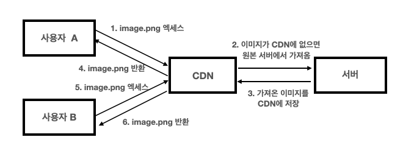
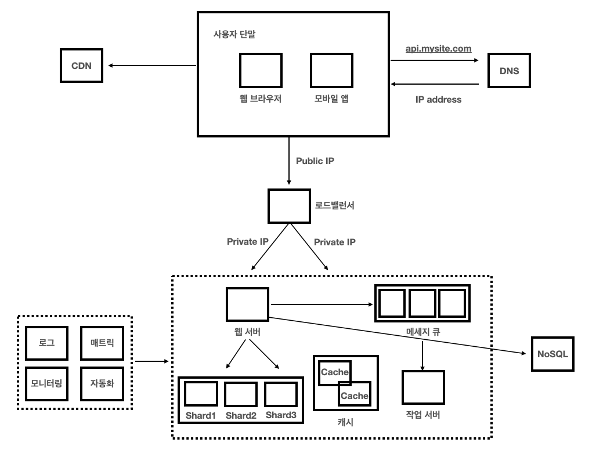

# 규모 확장성

수백만 사용자를 지원하는 시스템을 설계하는 것은 도전적이며, 지속적인 개량과 끝없는 개선이 요구된다. 한 대의 서버에서 시작해 다중화, 캐싱, 샤딩까지, 트래픽이 커질 때마다 어떤 도구를 어디에 끼워 넣어야 하는지 정리한다.

## 데이터베이스 선택

전통적인 **관계형 데이터베이스(RDB)** 와 **비관계형 데이터베이스(NoSQL)** 중에서 고를 수 있다.

다음과 같은 경우에는 비관계형 데이터베이스가 바람직한 선택일 수 있다.

- 아주 낮은 레이턴시가 요구된다.
- 다루는 데이터가 비정형이라 관계형 데이터가 아니다.
- 데이터를 직렬화/역직렬화할 수 있기만 하면 된다.
- 아주 많은 양의 데이터를 저장할 필요가 있다.

## 수직적 vs 수평적 규모 확장

- **수직적 규모 확장(Scale Up)**: 한 서버에 더 좋은 CPU, 더 많은 RAM 같은 고사양 자원을 추가하는 행위.
- **수평적 규모 확장(Scale Out)**: 더 많은 서버를 추가하여 성능을 개선하는 행위.

수직적 확장은 한계가 있다.

- 한 대의 서버에 CPU나 메모리를 무한대로 증설할 방법은 없다.
- 자동복구(failover)나 다중화 방안을 제시하지 않는다. 서버에 장애가 발생하면 서비스는 완전히 중단된다.

그렇기 때문에 대규모 애플리케이션을 지원하는 데는 **수평적 규모 확장**이 더 적절하다.

## 로드 밸런서

로드 밸런서는 부하 분산 집합에 속한 웹 서버들에게 트래픽 부하를 고르게 분산하는 역할을 한다.

- 사용자는 로드 밸런서의 **public IP**로 접속한다.
- 로드 밸런서는 **private IP**를 통해 내부 서버들과 통신한다.

로드 밸런서가 있으면 트래픽이 가파르게 증가해도 **서버를 추가하기만 하면 되기 때문에**, 우아하게 처리가 가능하다.

## 데이터베이스 다중화 (Replication)

데이터 원본은 **주(Master) 서버**에, 사본은 **부(Slave) 서버**에 저장하는 방식이다.

- 쓰기 연산은 마스터에서만 지원한다.
- 부 데이터베이스는 주 데이터베이스로부터 사본을 전달받으며 읽기 연산을 지원한다.
- 대부분의 애플리케이션은 읽기 비중이 쓰기보다 훨씬 높기 때문에, 통상 **부 데이터베이스의 수가 주 데이터베이스보다 많다**.

### 다중화의 장점

- **성능**: 데이터 변경 연산은 주 데이터베이스, 읽기 연산은 부 데이터베이스로 분산되어 병렬 처리 가능한 질의 수가 늘어나므로 성능이 좋아진다.
- **안정성(Reliability)**: 자연 재해 등의 이유로 데이터베이스 서버 일부가 파괴되어도 데이터는 보존된다. 데이터를 지역적으로 떨어진 여러 장소에 다중화시켜 놓을 수 있기 때문이다.
- **가용성(Availability)**: 데이터를 여러 지역에 복제해 둠으로써, 하나의 데이터베이스 서버에 장애가 발생하더라도 다른 서버의 데이터를 가져와 계속 서비스할 수 있다.

### 안정성 vs 가용성

비슷해 보이지만 다음과 같은 차이가 있다.

| 상황 | 안정성 | 가용성 |
|---|---|---|
| 데이터 살아있음 | O | 상관없음 |
| 서비스 응답 가능 | 상관없음 | O |
| DB 서버가 다 죽고 백업만 있는 경우 | O | X |
| DB 하나 죽었지만 바로 failover | X | O |

### 데이터베이스 장애 케이스

- **부 서버가 한 대뿐인데 다운된 경우**: 읽기 연산은 한시적으로 모두 주 데이터베이스로 전달되고, 즉시 새로운 부 데이터베이스 서버가 장애 서버를 대체한다.
- **부 서버가 여러 대인 경우**: 읽기 연산은 나머지 부 데이터베이스 서버들로 분산되고, 새로운 부 데이터베이스 서버가 장애 서버를 대체한다.
- **주 데이터베이스 서버가 다운된 경우**: 부 데이터베이스 중 하나가 새로운 주 서버로 승격된다. 부 서버에 보관된 데이터가 최신 상태가 아닐 가능성이 있기 때문에 누락된 데이터는 **복구 스크립트**를 돌려 추가해야 한다. 이런 케이스에서는 **다중 마스터**나 **원형 다중화** 방식이 도움이 될 수 있다.

## 캐시

캐시 계층은 데이터가 잠시 보관되는 곳으로 데이터베이스보다 훨씬 빠르다. 별도의 캐시 계층을 두면 성능이 개선될 뿐 아니라 데이터베이스의 부하를 줄일 수 있고, 캐시 계층의 규모를 독립적으로 확장하는 것도 가능해진다.

### 캐시 사용 시 유의할 점

- **캐시가 바람직한 상황**: 데이터 갱신보다 참조가 훨씬 많은 경우.
- **캐시에 둘 데이터**: 영속적으로 보관할 데이터를 캐시에 두는 것은 바람직하지 않다. 중요한 데이터는 **persistent data store**에 두어야 한다.
- **캐시 만료 정책**: 만료 정책이 없으면 데이터는 캐시에 계속 남는다. 만료 기한이 너무 짧으면 데이터베이스를 많이 조회하게 되고, 너무 길면 원본과 차이가 날 수 있다.
- **일관성 유지**: 저장소의 원본을 갱신하는 연산과 캐시를 갱신하는 연산이 단일 트랜잭션으로 처리되지 않으면 일관성이 깨질 수 있다.
- **장애 대응(SPOF)**: 캐시 서버를 한 대만 두면 SPOF가 된다. 이를 피하려면 여러 지역에 걸쳐 캐시 서버를 분산시켜야 한다.
- **캐시 메모리 크기**: 너무 작게 잡으면 액세스 패턴에 따라 데이터가 자주 캐시에서 밀려나 성능이 떨어진다. 캐시 메모리를 **과할당**하는 것이 해결책이 될 수 있다.
- **데이터 방출(Eviction)**: 캐시가 꽉 차면 새 데이터를 넣기 위해 기존 데이터를 내보내야 한다. **LRU**(가장 오래 전에 사용), **LFU**(사용 빈도가 가장 낮음), **FIFO**(가장 먼저 들어옴) 등의 정책이 있다.

## CDN (Content Delivery Network)

정적 콘텐츠를 전송하는 데 쓰이는, 지리적으로 분산된 서버의 네트워크다. 이미지, 비디오, CSS, JavaScript 등을 캐시할 수 있다.

## 무상태 계층

웹 계층을 수평적으로 확장하기 위해서는 **사용자 세션 데이터와 같은 상태 정보를 웹 계층에서 제거**하고 별도의 지속적인 저장소(예: Redis, RDB)에 보관한다.

### 상태 의존적인 아키텍처

상태 의존적인 아키텍처에서는 사용자 A의 세션 정보나 프로필 이미지 등이 **서버 1**에만 저장된다. 그 말은, 사용자 A를 인증하기 위한 HTTP 요청은 반드시 서버 1로 전송되어야 한다는 뜻이다. 서버 2에는 사용자 A에 관한 데이터가 없기 때문에 서버 2로 전송되면 인증이 실패한다.

이를 지원하기 위해 로드 밸런서가 **고정 세션(Sticky Session)** 기능을 제공하지만, 이는 로드 밸런서에 부담을 주고 부하 분산을 비효율적으로 만든다.

### 무상태 아키텍처

이 구조에서 사용자로부터의 HTTP 요청은 **어떤 웹 서버로도 전달될 수 있다**. 상태 정보가 웹 서버로부터 물리적으로 분리되어 있기 때문이다.

이런 구조는 **단순하고, 안정적이며, 규모 확장이 쉽다**.

## 메시지 큐

메시지 큐는 메시지의 무손실을 보장하는 **비동기 통신**을 지원하는 컴포넌트다.

- 서비스/서버 간 결합이 느슨해진다 (Loose Coupling).
- 생산자와 소비자가 독립적으로 확장될 수 있다.
- 규모 확장성이 보장되어야 하는 안정적 애플리케이션을 구성하기에 적합하다.

## 메트릭

메트릭을 잘 수집하면 사업 현황에 대한 유용한 정보를 얻을 수 있고, 시스템의 현재 상태를 손쉽게 파악할 수도 있다.

- **호스트 단위 메트릭**: CPU, 메모리, 디스크 I/O
- **종합 메트릭**: DB 계층의 성능, 캐시 계층의 성능
- **핵심 비즈니스 메트릭**: DAU, 수익, 재방문 등

## 데이터베이스의 규모 확장

### 수평적 확장

샤딩은 대규모 데이터를 **샤드(shard)** 라고 부르는 작은 단위로 분할한다.

예를 들어 `user_id % 4`를 해시 함수로 사용하면, 결과가 0이면 0번 샤드, 1이면 1번 샤드에 데이터를 보관할 수 있다.

### 샤딩 도입 시 고려할 점

- **재샤딩(Resharding)**: 데이터가 너무 많아져서 하나의 샤드로 감당하기 어렵거나, 샤드 간 데이터 분포가 균등하지 않아 특정 샤드의 공간 소모가 다른 샤드보다 빨리 진행될 때 발생한다. 샤드 키를 계산하는 함수를 변경하고 데이터를 재배치해야 한다.
- **유명 인사 문제 (Hotspot Key Problem)**: 특정 샤드에 질의가 집중되어 서버에 과부하가 걸리는 문제다.
- **조인과 비정규화**: 하나의 DB를 여러 샤드 서버로 쪼개고 나면, 여러 샤드에 걸친 데이터를 조인하기가 어렵다. 이를 해결하기 위해 데이터베이스를 **비정규화**하여 하나의 테이블에서 질의가 끝나도록 설계한다.

## 정리

- 웹 계층은 **무상태 계층**으로 구성한다.
- 모든 계층에 **다중화**를 도입한다.
- 가능한 한 많은 데이터를 **캐시**한다.
- 여러 **데이터 센터**를 지원한다.
- 정적 콘텐츠는 **CDN**을 통해 서비스한다.
- 데이터 계층은 **샤딩**을 통해 그 규모를 확장한다.
- 각 계층은 **독립적 서비스**로 분할한다.
- 시스템을 **지속적으로 모니터링**하고, **자동화 도구**들을 활용한다.

## 나의 생각

### 1. 수평 확장은 정말 만능인가?

[Stack Overflow](https://highscalability.com/stack-overflow-architecture/)의 2009년 아키텍처를 보면, 당시 약 300만 MAU를 처리하면서도 비교적 단순한 구조를 유지하고 있었다.
웹 서버는 4코어, 8GB RAM 수준이었고, 데이터베이스 역시 8코어, 48GB RAM 단일 노드에 크게 의존하는 구조였다.

이들은 초기 단계에서 수평 확장 대신 단일 데이터베이스 기반 구조를 유지했다.
그 결과 가용성 일부를 희생했지만, 시스템의 단순성과 데이터 일관성을 확보할 수 있었다.

이는 모든 시스템이 처음부터 분산 시스템일 필요는 없다는 중요한 사실을 시사한다.

물론 대부분의 서비스에서 가용성과 안정성은 중요하다.
하지만 수평 확장은 단순히 서버를 늘리는 문제가 아니라, 분산 시스템을 운영하는 복잡성을 함께 도입하는 선택이다.

- 데이터 일관성 문제
- 복제 지연
- 장애 전파

등의 엔지니어링적으로 큰 비용을 감당해야 한다.

어쩌면 우리는 단순한 구조로도 충분히 해결 가능한 문제를, 너무 이르게 복잡한 시스템으로 풀고 있는 것은 아닐까?
중요한 것은 수평/수직 확장의 트레이드 오프를 이해하고, 현재의 트래픽 규모, 조직의 운영 역량, 그리고 요구되는 가용성과 일관성 수준을 종합적으로 고려해 적절한 시점에 도입하는 것이다.